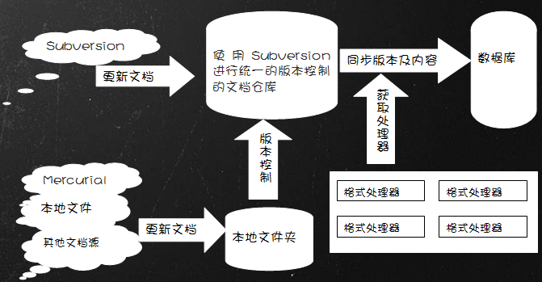

平台工作流程
================

本文主要从平台的整个工作流程进行技术架构方面的介绍，以使读者对整个项目结构有一个基本的了解。
关于具体的实现及代码细节可以参考下文。

从整个流程上来说，一个项目的英文文档翻译为中文的过程可以归结为 更新 －> 同步 -> 翻译 -> 导出 这么一个过程。
其中这些过程又是相互交错，循环进行的。

整个过程的流程示意图如下：

.. image:: pic1.png

更新和同步
------------

即将英文文档同步到本地的一个过程，一个项目的文档通常有各自不同的存储方式。
比如以SVN，Mercurial，或Git等版本控制系统提供，或以文件下载的方式提供。

由于要将英文文档进行版本控制，以便可以取得变化信息，及时的更新相应的中文翻译。
但是以上所提供的各种方式所提供的版本控制各自不相同，
所以为了方便，在本地将以SVN方式的对文档版本进行统一的版本管理。

对于SVN方式提供文档的项目，可以直接使用该SVN仓库所提供的版本信息，对于其他各种方式提供文档的项目，
在将文档同步到本地后，还需要再次处理，存入一个本地的SVN仓库，以获得SVN版本控制信息，所以这一步的具体过程表现为如下图所示：

在将文档统一下载或更新（因为这是一个循环的过程），并以SVN方式进行统一的版本管理之后，接下来就是
如何将文档进行智能分段，连同版本信息同步到数据库中，以便提供一个Web的方式让翻译者进行翻译的提交及更新。

首先是关于如何取得版本信息，这是通过 `pysvn <http://pysvn.tigris.org/>`_ 这个Python库来进行的，在此不作详述。

其次是关于如何为文档进行分段，也就是将文档切分为既有合适的长度，又能够提供足够上下文信息的段落。
通常项目文档的结构都符合 段落标题+段落内容 的形式，即一篇文档通常是由多个这种形式的段落组成，而其中段落与段落之间又通常符合一定的模式。

所以在这里，对于智能分段的方法，主要是通过正则表达式来实现的。尤其是对于Python项目的文档来说，基本都是以reStructuredText格式编写的。
reStructuredText格式的文档，每段基本都是以如下所示的形式表示::

	Introduction
	============
	
	This is the documentation for the Jinja2 general purpose templating language.
	Jinja2 is a library for Python 2.4 and onwards that is designed to be flexible,
	fast and secure.
	
	If you have any exposure to other text-based template languages, such as Smarty or
	Django, you should feel right at home with Jinja2.  It's both designer and
	developer friendly by sticking to Python's principles and adding functionality
	useful for templating environments.
	
基本上通过一个正则表达式就可以很方便的分段。

一个文档分段后，就可以将段落内容，版本信息，在整篇文档中的顺序等信息存入数据库给译者进行翻译了。

翻译
-----------

翻译主要是通过Web界面进行提交，可以参考 http://docspot.org/trans/help/ 上具体的帮助信息，再此也不作详述。

导出
-----------

在翻译的过程中，应该随时可以进行文档的导出，以便读者可以尽快阅读到翻译后的成果，也有利于信息的及时反馈。
对于Sphinx类型的文档或reStructuredText类型的文档，均提供了转换到HTML格式功能。

英文文档得导出可以直接从SVN仓库中 svn export 导出一份记录，作为生成HTML格式或其他格式之用。

中文文档的导出也可以以直接从SVN仓库中 svn export 导出一份记录，
然后从数据库中找出每个段落的最新一个相应翻译或直接以段落原文作为翻译（如果尚未翻译的话），按顺序重新组合成全文，
将全文写回到export出的文档目录中相应文件。

然后就可以通过提供的转换工具转换成HTML或其他格式的文档了。
